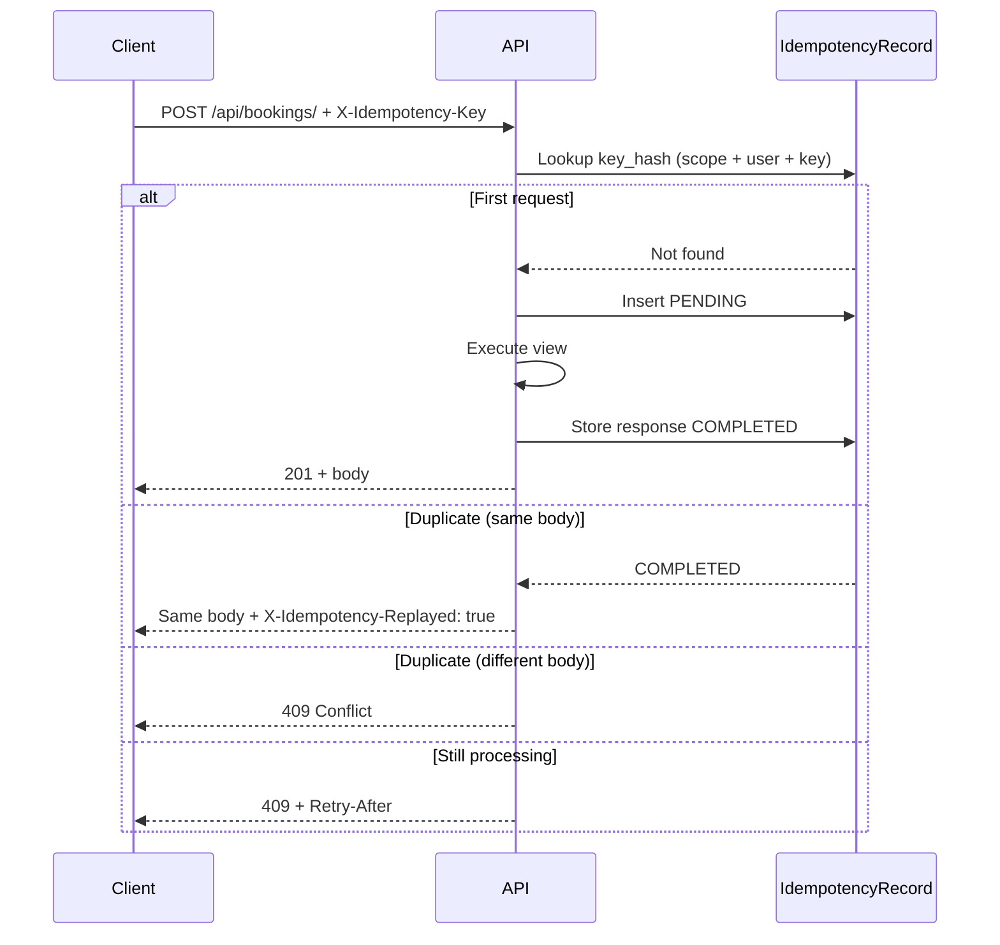

# Vasavi API — Security & Idempotency

This document describes how the backend prevents duplicate writes, replay spam, and accidental double-charging when clients retry network requests. It covers the **`X-Idempotency-Key`** header, what is implemented today, and how frontends and admins should use it.

---

## 1. Goals

| Threat | Mitigation |
|--------|------------|
| User double-taps “Book now” | Same idempotency key → one booking, same response replayed |
| Mobile app retries POST on timeout | Safe retry without second Razorpay order |
| OTP spam / SMS cost abuse | Required key + rate limits (`OTPLog.can_send`) |
| Webhook replay (Razorpay) | Signature verification (not client idempotency keys) |
| Admin export hammering | Idempotency on export enqueue + Celery queue |

**Idempotency does not replace authentication.** Every protected route must still require a valid session/JWT and server-side role checks.

---

## 2. `X-Idempotency-Key` overview

### 2.1 Client responsibility

For every **mutating** API call (`POST`, `PUT`, `PATCH`) under protected prefixes, the client **must** send:

```http
X-Idempotency-Key: 7c9e6679-7425-40de-944b-e07fc1f90ae7
```

Also accepted (alias):

```http
Idempotency-Key: 7c9e6679-7425-40de-944b-e07fc1f90ae7
```

**Rules for clients**

1. Generate a **new UUID v4** (or similar) per *logical* user action (one tap = one key).
2. On **retry** of the *same* action (same payload), **reuse the same key**.
3. Key length: **8–128** characters; charset: `A–Z`, `a–z`, `0–9`, `.`, `_`, `-`.
4. Do **not** reuse keys across different actions (different dates, rooms, amounts).
5. Store the key in memory until the response succeeds or definitively fails (4xx you won't retry).

### 2.2 Server behaviour

Implemented in:

| Component | Path |
|-----------|------|
| Middleware | `core.middleware.IdempotencyMiddleware` |
| Logic | `core/idempotency.py` |
| Storage | `core.idempotency_models.IdempotencyRecord` |
| Settings | `config/settings/base.py` (`IDEMPOTENCY_*`) |
| Per-view scope | `core.decorators.idempotency_scope` |

**Flow**



**Response headers**

| Header | Meaning |
|--------|---------|
| `X-Idempotency-Replayed: true` | Cached response returned; no side effect |
| `X-Idempotency-Key-Status: completed` | Fresh request completed successfully |
| `X-Idempotency-Key-Status: failed` | Request finished with 5xx; same key may retry |
| `Retry-After` | Seconds to wait when status is `pending` |

**HTTP status codes**

| Code | Situation |
|------|-----------|
| `400` | Missing key when required, or invalid key format |
| `409` | Key reused with different body, or request still `pending` |
| `2xx` / `4xx` | Normal outcome (4xx responses are stored and replayed) |

### 2.3 Scoping (who owns a key?)

The server never stores the raw client key. It persists:

```text
key_hash = SHA256("{scope}:{actor_id}:{client_key}")
```

- **scope** — operation type (e.g. `booking.create`, `otp.send`)
- **actor_id** — authenticated `user.pk`, or `anon` for unauthenticated routes
- **client_key** — value from `X-Idempotency-Key`

This prevents one user from replaying another user's key and separates OTP vs booking namespaces.

**Built-in scopes** (`core.idempotency.IdempotencyScope`):

| Scope | Typical endpoint |
|-------|------------------|
| `booking.create` | `POST /api/bookings/` |
| `booking.payment_order` | `POST /api/bookings/.../payment/order/` |
| `booking.cancel` | `POST /api/bookings/.../cancel/` |
| `otp.send` | `POST /api/accounts/.../otp/send/` |
| `otp.verify` | `POST /api/accounts/.../otp/verify/` |
| `donor.export` | `POST /api/donors/.../export/` |
| `donation.create` | `POST /api/donors/.../donations/` |
| `coupon.dispatch` | `POST /api/coupons/.../dispatch/` |

Override scope on a view:

```python
from core.decorators import idempotency_scope

@idempotency_scope("booking.create")
def create_booking(request):
    ...
```

### 2.4 Protected vs excluded paths

Configured in `settings.py`:

**Protected** (key required when `IDEMPOTENCY_KEY_REQUIRED=True`):

- `/api/accounts/`
- `/api/bookings/`
- `/api/donors/`
- `/api/coupons/`

**Excluded** (no client idempotency key):

- `/api/bookings/webhooks/` — Razorpay uses `X-Razorpay-Signature`, not idempotency keys
- `/admin/` — Django admin

`GET`, `HEAD`, `DELETE` are not idempotency-wrapped by middleware (reads use normal caching; deletes should get keys when implemented).

---

## 3. Endpoint matrix (planned + current)

| Endpoint | Method | Idempotency | Auth | Notes |
|----------|--------|-------------|------|-------|
| Create booking | POST | **Required** | User JWT | One key per checkout attempt |
| Create Razorpay order | POST | **Required** | User JWT | Pairs with `bookings.tasks.razorpay_create_order` |
| Razorpay webhook | POST | Excluded | HMAC signature | Async via Celery |
| Send OTP | POST | **Required** | Public | Combine with `OTPLog.can_send()` |
| Verify OTP | POST | **Required** | Public | Same key only if retrying exact verify |
| Donor export | POST | **Required** | Super admin | One export job per key |
| List bookings | GET | N/A | User JWT | Safe, cacheable |

When a view is not yet implemented, middleware still enforces the header on protected prefixes — clients should send keys now so behaviour is consistent on launch.

---

## 4. Frontend integration (vasavi-main-site)

### 4.1 Generate and attach key

```typescript
import { randomUUID } from "crypto";

function idempotencyHeaders(logicalActionId?: string) {
  const key = logicalActionId ?? randomUUID();
  return {
    "X-Idempotency-Key": key,
    "Content-Type": "application/json",
  };
}

// Example: create booking with retry
async function createBooking(payload: BookingPayload) {
  const key = randomUUID();
  const headers = { ...authHeaders(), "X-Idempotency-Key": key };

  for (let attempt = 0; attempt < 3; attempt++) {
    const res = await fetch("/api/bookings/", {
      method: "POST",
      headers,
      body: JSON.stringify(payload),
    });
    if (res.status === 409) {
      const retryAfter = Number(res.headers.get("Retry-After") ?? 2);
      await sleep(retryAfter * 1000);
      continue; // same key + same body
    }
    return res;
  }
}
```

### 4.2 Payment flow

1. `POST /api/bookings/` with key **K1** → booking row created.
2. `POST /api/bookings/{id}/payment/order/` with key **K2** (new key) → Celery/API creates Razorpay order.
3. User pays in Razorpay checkout (client-side).
4. Webhook updates payment — **no** `X-Idempotency-Key` on webhook.

Never reuse **K1** for payment order creation.

### 4.3 Detect replay

```typescript
if (response.headers.get("X-Idempotency-Replayed") === "true") {
  // UI: treat as success; optional toast "Already submitted"
}
```

---

## 5. Configuration (environment)

| Variable | Default | Description |
|----------|---------|-------------|
| `IDEMPOTENCY_KEY_REQUIRED` | `True` | Reject protected POST/PUT/PATCH without header |
| `IDEMPOTENCY_TTL_HOURS` | `24` | How long replay cache is kept |
| `IDEMPOTENCY_RETRY_AFTER_SECONDS` | `2` | `Retry-After` when request is `pending` |

Add to `.env`:

```env
IDEMPOTENCY_KEY_REQUIRED=True
IDEMPOTENCY_TTL_HOURS=24
IDEMPOTENCY_RETRY_AFTER_SECONDS=2
```

**Development tip:** Set `IDEMPOTENCY_KEY_REQUIRED=False` only locally if needed; keep `True` in staging/production.

---

## 6. Operations & maintenance

### 6.1 Database migration

```bash
python manage.py makemigrations core
python manage.py migrate
```

### 6.2 Cleanup expired records

Add a periodic Celery task (recommended) or cron:

```sql
DELETE FROM core_idempotencyrecord WHERE expires_at < NOW();
```

TTL is set at creation (`now + IDEMPOTENCY_TTL_HOURS`).

### 6.3 Monitoring

Log fields to watch:

- Rate of `409` idempotency conflicts (may indicate client bugs)
- Rate of `X-Idempotency-Replayed` (healthy retries)
- `pending` rows older than 5 minutes (stuck requests / worker crashes)

---

## 7. Related security controls (roadmap)

These complement idempotency but are separate:

| Control | Status | Notes |
|---------|--------|-------|
| JWT / session auth | Planned | All `/api/*` except OTP send/verify/webhooks |
| Rate limiting (IP / phone) | Partial | `OTPLog.can_send()` only |
| Razorpay webhook HMAC | Implemented | `RAZORPAY_WEBHOOK_SECRET` |
| CORS allowlist | Planned | Next.js origins only |
| CSRF | N/A for token APIs | Session cookie admin only |
| Branch RBAC | Model-level | Enforce in every queryset |
| Audit log | Partial | `BookingStatusLog` |

---

## 8. Threat model summary

| Attack | Idempotency helps? |
|--------|-------------------|
| Double-submit booking | **Yes** |
| Retry storm with same payload | **Yes** (replay cached response) |
| Attacker tries random keys | **No** — needs auth + rate limits |
| Attacker replays stolen key | **Partial** — scoped to user + 24h TTL |
| Webhook forgery | **No** — use Razorpay signature |
| OTP flooding | **Partial** — use key + `OTPLog.can_send()` + IP limits |

---

## 9. Checklist for new write endpoints

1. Add route under a **protected prefix** or set `@idempotency_scope("your.scope")`.
2. Document required `X-Idempotency-Key` in OpenAPI/README.
3. Ensure view returns **JSON** (middleware caches `response.content` as JSON).
4. For long-running work, return `202` quickly with a job id; store that in idempotency cache.
5. Do not require idempotency on **webhooks** or **GET**.
6. Add server-side validation (amounts, dates, branch scope) independent of idempotency.

---

## 10. References

- [Stripe Idempotency](https://stripe.com/docs/api/idempotent_requests) — industry pattern
- [IETF draft: Idempotency-Key header](https://www.ietf.org/archive/id/draft-ietf-httpapi-idempotency-key-header-00.html)
- Implementation: `backend/core/idempotency.py`, `backend/core/middleware.py`
